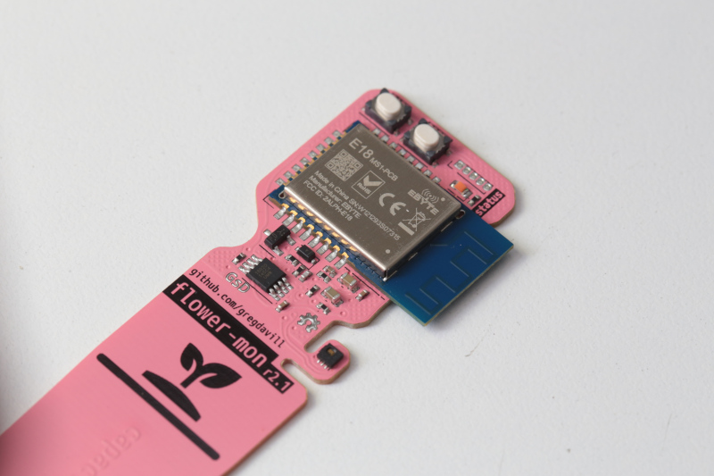

# Zigbee Plant Watering Sensor

New circuit board layout based off the following projects:
 - https://github.com/smartboxchannel/Plant-Watering-Sensor-Zigbee
 - https://github.com/diyruz/flower

Capacitance sensor soil moisture sensor based on the CC2530 SoC.
Designed to communicate over Zigbee to a coordinator.
Powered from a CR2032, optional humidity, and temperature sensors.

## Photo
 
